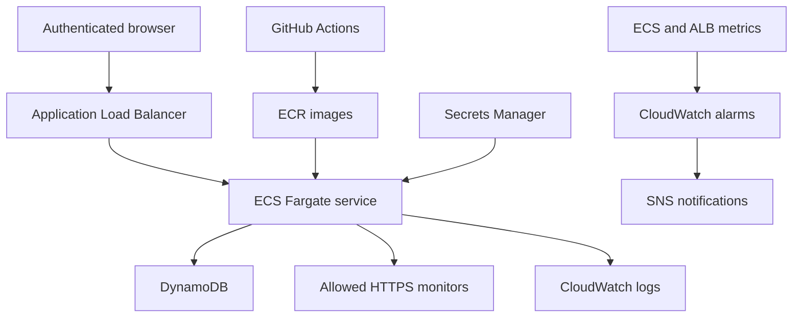

# CloudPulse

A complete cloud operations portfolio project: a service reliability dashboard, health-check API, persistent check history, incident workflows, and AWS deployment infrastructure.

**Included:** React + TypeScript frontend, shared monitoring backend, SQLite local storage, Cloudflare D1 private demo, DynamoDB AWS adapter, Docker, Terraform, CloudWatch alarms, SNS notifications, and GitHub Actions validation and deployment.

The private demo is a working practice environment. Three starter monitors and their initial history are simulated and labeled. The CloudPulse API monitor checks database readiness in the running server. No AWS infrastructure is provisioned by opening the demo.

## Run locally

Requires Node.js 24 and pnpm 11.25.0.

```bash
corepack enable
pnpm install --frozen-lockfile
pnpm build:aws
pnpm start:local
```

Open `http://localhost:3000`. Local development starts without a password unless `DASHBOARD_TOKEN` is set. State is saved in `data/cloudpulse.db`. The server probes every 60 seconds even with the page closed; set `CHECK_INTERVAL_SECONDS=0` to disable the scheduler.

On Windows, run these commands in PowerShell or a terminal with Node.js installed. Set an environment variable with `$env:DASHBOARD_TOKEN = 'your-own-random-password'` before starting if needed.

## Run with Docker

Copy `.env.example` to `.env` and replace the password with a random value of at least 24 characters. Then:

```bash
docker compose up --build -d
```

Open `http://localhost:3000`, enter any username, and use your `DASHBOARD_TOKEN` as the password. The container binds only to your computer's loopback interface and persists SQLite in a named volume.

```bash
docker compose logs -f
docker compose down
```

`docker compose down` preserves data. Adding `-v` deletes the local data volume.

## Try the incident workflow

1. Click **Run checks** to measure the API and collect simulated service checks.
2. Inspect **Commerce API** and choose **Unavailable**, then **Apply & run checks**.
3. Open the resulting P1 incident and acknowledge it with an investigation note.
4. Restore the service to **Operational** and run checks again. Its automatic incident resolves and preserves the timeline.
5. Report a manual incident, acknowledge it, and resolve it with a note. Manual incidents require manual resolution.
6. Pause a monitor, run checks, and verify it does not receive new samples. Resume to continue monitoring.

The seeded order-processor incident is a manual practice incident; resolve it yourself after restoring the service to Operational.

## Add real monitors

Set `MONITOR_ALLOWED_HOSTS` to a comma-separated list of exact public hostnames you control and trust, restart the local server, then add a **Live HTTPS endpoint** monitor. Example:

```bash
MONITOR_ALLOWED_HOSTS=api.your-domain.com pnpm start:local
```

For Docker, edit the variable in `.env` and run `docker compose up -d`. For AWS, set `monitor_allowed_hosts` in Terraform and apply the configuration. For the private demo, configure the same variable as a hosted runtime value.

Only HTTPS on port 443 is allowed; embedded credentials, IP literals, local hostnames, unlisted hosts, and automatic redirects are rejected. The host allowlist is an administrator-controlled trust boundary, not a general-purpose SSRF proxy. Do not allow domains that resolve to private networks or that an untrusted user controls.

## What the numbers mean

- **Operational:** HTTP 2xx in at most 1,000 ms.
- **Degraded:** HTTP 2xx taking more than 1,000 ms.
- **Down:** non-2xx response, network error, or timeout (7 seconds).
- **Check availability:** non-down checks divided by collected checks; degraded responses count as available. This is a sampled availability estimate, not continuous wall-clock uptime or a contractual SLO.
- **Average response:** latest measured latency for each service with a response, including simulated practice services.
- **Retention:** latest 96 checks per monitor, up to 24 monitors, and a 300-record incident list. These are bounded portfolio-workspace limits.
- The private demo runs checks every 60 seconds **while the dashboard is open**, or on demand. The AWS/local runtime also has a server-side scheduler. A database lease prevents overlapping probe batches across tasks and tabs.
- Automatic incidents open after the first unhealthy check and resolve after the first healthy check. This intentionally makes the practice loop quick; production alerting should use consecutive-failure thresholds and a defined recovery policy.

## AWS architecture



The Terraform lab uses two public subnets and Fargate public IPs for outbound HTTPS, with task ingress restricted to the ALB security group. It avoids provisioning NAT gateways. A production deployment can move tasks to private subnets and provide NAT or suitable VPC endpoints. The ALB accepts only configured trusted CIDRs; the app additionally uses a password supplied through Secrets Manager. Use an ACM certificate and matching custom domain before using the AWS dashboard with real data.

See [AWS deployment guide](docs/AWS_DEPLOYMENT.md), [API reference](docs/API.md), [incident runbook](docs/RUNBOOK.md), and [verification report](docs/VERIFICATION.md).

## CI/CD

`.github/workflows/ci.yml` runs application workflow tests, TypeScript checking, the standalone frontend build, Docker build, Terraform formatting, initialization, and validation on pushes and pull requests.

`.github/workflows/deploy.yml` is a manually triggered application release from `main`. It obtains temporary AWS credentials through GitHub OIDC, builds an immutable image, pushes to ECR, registers an ECS task revision, and waits for a stable service. It fails if ECS rolls back to a different revision. Terraform creates infrastructure; the release workflow owns application task revisions. Infrastructure changes are applied separately after reviewing a Terraform plan.

## Repository map

| Path | Purpose |
| --- | --- |
| `components/dashboard.tsx` | Shared interactive dashboard |
| `core/api.ts` | Validation, health probes, incident lifecycle, API |
| `core/types.ts` | Data and persistence contracts |
| `app/api/[...path]/route.ts` | Hosted demo API |
| `db/`, `drizzle/` | D1 persistence and versioned migrations |
| `aws/` | Node runtime, SQLite and DynamoDB adapters, standalone build |
| `infra/` | VPC, ECS, ECR, IAM, ALB, DynamoDB, logging, alarms |
| `tests/` | Stateful backend workflow verification |
| `docs/` | Deployment, API, troubleshooting, and verification |

## Resume wording after you understand the project

“Built CloudPulse, a service reliability dashboard with health probes, persistent check history, and incident automation; implemented Docker packaging, Terraform infrastructure for ECS Fargate and DynamoDB, and GitHub Actions CI/CD.”

Only claim an AWS deployment, measured reliability improvement, or production operation after you perform and verify it. The private hosted demo and the included AWS infrastructure are distinct deployment targets.
